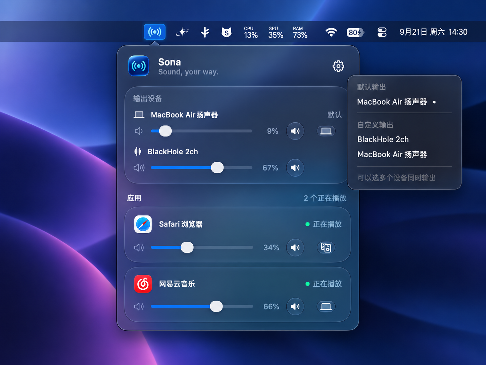

# Sona

macOS 菜单栏音频控制工具：为每个应用独立调节音量，并选择一个或多个输出设备。



**当前为预览版。** 官网提供 `.pkg` 安装包（未公证，首次打开需在「隐私与安全性」里允许一次），也可以自行编译。App 要求 macOS 26 或更高版本，当前构建目标为 Apple Silicon。已有验证范围见 [兼容性与测试记录](docs/COMPATIBILITY.md)。

## 功能

- 逐应用调节音量和静音。
- 为不同应用选择不同输出，或让一个应用同时输出到多个设备。
- 独立控制各输出设备音量；键盘音量键控制所选默认输出。
- 显示正在发声的应用，保存应用音量和路由设置。
- 可选在耳机、USB 或蓝牙等新设备接入时自动切换默认输出。

Sona 使用 HAL 虚拟输出设备和独立音频服务处理声音，不使用 Process Tap，不申请系统录音或麦克风权限。Sona 自身不读取麦克风；其他应用的录音指示不由 Sona 控制。

## 构建

需要 macOS 26+、Apple Silicon、支持 macOS 26 SDK 的 Xcode 命令行工具或 Xcode，以及 `python3`。App 的最低系统版本由 Swift package 和 Info.plist 声明；驱动/服务的 macOS 14 编译目标不代表整个产品支持 macOS 14。

在源码根目录执行：

```sh
make test-all       # 单元测试（含 App）与最终驱动 HAL 边界检查
make                # 构建驱动、服务和 App
```

App 位于 `App/build/Sona.app`。当前采用本地 ad-hoc 签名，尚无正式签名、公证的安装包。驱动与服务默认包含 arm64/x86_64，App 当前只构建 arm64；Intel 不在完整应用的已验证支持范围内。

## 安装与使用

### 用安装包（推荐）

从官网下载 `Sona-<版本>.pkg`（`make release` 生成，见下文）。安装包尚未经过 Apple 公证，首次打开会被 macOS 拦下：点「完成」，到「系统设置 → 隐私与安全性」底部点「仍要打开」并输入密码；或者在终端直接安装：

```sh
sudo installer -pkg ~/Downloads/Sona-0.6.0.pkg -target /
```

安装程序会放置 `/Applications/Sona.app`、`/Library/Audio/Plug-Ins/HAL/SonaDriver.driver`、`/Library/PrivilegedHelperTools/SonaAudioService` 和对应的 LaunchDaemon，然后启动服务、重启 coreaudiod（正在播放的声音停顿一两秒）并打开 Sona。升级时直接安装新版本即可。

### 从源码

安装会写入系统目录并重启 coreaudiod，正在播放的音频会短暂中断。先完成构建，再按顺序安装：

```sh
sudo make install-service
sudo make install-driver
make run
```

### 开始使用

1. 打开菜单栏的 Sona，选择默认物理输出设备。
2. 打开总开关，系统默认输出切换到 Sona。
3. 播放声音后，调整列表中应用的音量，或为它选择一个或多个输出。
4. 正常退出 Sona 时，App 会尝试把系统输出切回所选默认设备。

服务通过 launchd 独立运行，设置保存在 App 的 UserDefaults 和服务的 `/Library/Application Support/Sona/service-state.plist`。服务不可用时音频可能静音；可在系统设置的“声音”中手动选择物理输出恢复播放。

## 卸载

先在 Sona 菜单里点「退出 Sona」，让它把系统输出切回物理设备。用安装包装的：

```sh
sudo "/Library/Application Support/Sona/uninstall.sh"          # 保留设置
sudo "/Library/Application Support/Sona/uninstall.sh" --purge  # 连设置一起删除
```

从源码装的：

```sh
sudo make uninstall-driver
sudo make uninstall-service
```

如果曾执行 `make install-app`，再从“应用程序”删除 Sona。`make uninstall-*` 保留偏好设置和服务状态，方便重新安装。

## 制作安装包

```sh
make release        # build/release/Sona-<版本>.pkg 与 .sha256，并复制到 website/public/downloads
```

版本号取自 `App/Info.plist`，脚本会核对 `Driver/Info.plist` 和 `Shared/SonaProtocol.h` 一致。没有证书时全部为 ad-hoc 签名、安装包不签名。持有 Apple Developer Program 会员资格后，设置 `SONA_APP_IDENTITY`、`SONA_INSTALLER_IDENTITY` 和 `SONA_NOTARY_PROFILE`（`xcrun notarytool store-credentials` 创建）再运行同一命令，即得到 Developer ID 签名并公证的安装包，网站文案会自动去掉「仍要打开」的步骤。详见 `Installer/build-installer.sh`。

## 限制与验证范围

- 只处理输出到 Sona 的应用；自行选择具体物理设备的 DAW 等应用不受接管。
- 只处理输出，不提供逐应用麦克风路由。
- 多设备输出包含缓冲、重采样和时钟校正，不保证设备之间采样级同步。
- 同采样率且时钟锁定的默认输出可进入直通；多应用混音和数字音量仍会改变样本。
- 睡眠唤醒、蓝牙/USB 热插拔、多小时播放、快速用户切换和端到端延迟尚需完整实机验证。

详细状态、测试方法和结果见 [兼容性与测试记录](docs/COMPATIBILITY.md)。

## 架构与开发

```text
应用 → Sona HAL 虚拟设备 → 每客户端共享内存 → Sona Audio Service → 物理输出
                    ↑ 控制属性                        增益 / 路由 / 混音 / 重采样
               菜单栏 App
```

| 目录 | 职责 |
| --- | --- |
| `App/Sources/Sona/` | SwiftUI 菜单栏界面、系统输出与控制属性 |
| `Driver/` | AudioServerPlugIn 对象、客户端 PCM 传输、虚拟时钟 |
| `Service/` | 物理设备、应用增益、路由、混音、重采样与持久化 |
| `Shared/` | 控制属性和共享内存协议 |
| `Installer/` | pkg 安装器：Distribution、安装脚本、卸载脚本、`build-installer.sh` |
| `website/` | 官网（React + Vite），`public/downloads/` 存放当前安装包，部署到 Vercel |
| `Tools/` | `sonactl` 与驱动边界检查 |

驱动不得调用 Core Audio client HAL API；`make check-driver-boundary` 检查最终二进制，安装驱动也必须通过此检查。

- [架构规范与迁移记录](ARCHITECTURE.md)
- [变更记录](CHANGELOG.md)
- [贡献指南](CONTRIBUTING.md)
- [历史实现与回归步骤](docs/DEVELOPMENT-NOTES.md)
- [来源与发布检查](docs/RELEASE-CHECKLIST.md)

诊断日志：

```sh
log show --last 2m --predicate 'subsystem == "com.sona.driver" OR subsystem == "com.sona.audio-service"'
```

`make loopback-tools` 可构建诊断工具，随后运行 `Tools/build/sonactl service` 读取服务状态。提交日志前请检查应用名称和设备标识等个人信息。

## 许可证

Copyright © 2026 Haoyang Jin.

Sona 采用 [GNU General Public License v3.0](LICENSE) 授权，全文见仓库根目录的 [`LICENSE`](LICENSE)。你可以自由运行、研究、修改和重新分发本程序；修改版和基于本程序的衍生作品必须以同一许可证发布并提供对应源码，同时保留上面的版权声明。

`website/public/downloads/` 里的 `.pkg` 是 `make release` 的构建产物，其源码就是本仓库内容，不额外引入本许可证之外的条款。第三方依赖与 macOS 系统框架各自的许可证不受本节影响。
